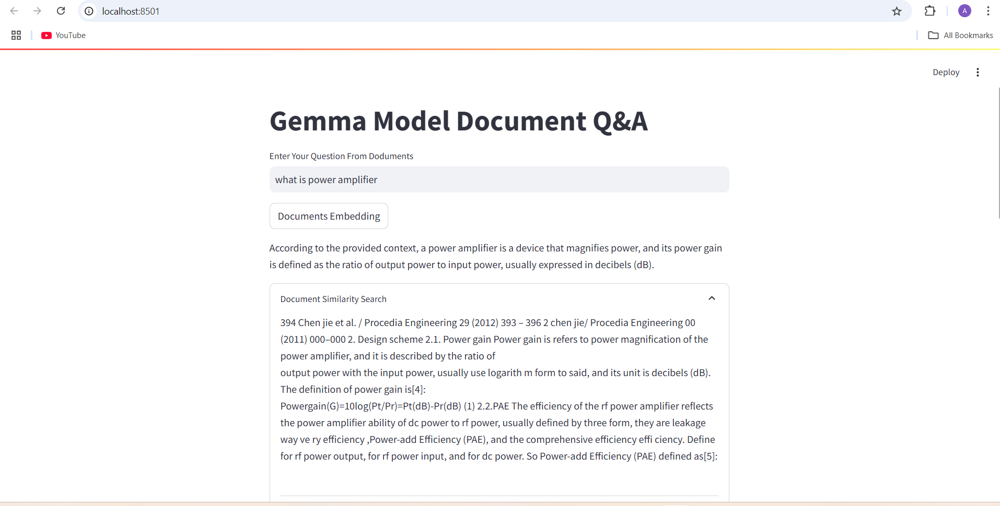

# Ayush_Harshit_Attentions.ai_Oncampus
# Power Amplifier Design Research Paper Query with LangChain & Gemma LLM

This project is an interactive web app for querying a collection of research papers on Power Amplifier Design. It leverages the Gemma model through the Groq API with the LangChain framework to implement a Q&A system, enabling users to ask specific questions and retrieve relevant answers from research content.

## Features

- **Custom ChatBot with LLM**: Uses the Gemma model (via the Groq API) with a tailored prompt for accurate Q&A responses.
- **Research Paper Document Loader**: Loads PDFs from a designated folder and chunks them for efficient embedding.
- **Vector Embeddings and Storage**: Uses FAISS for storing document embeddings, enabling fast similarity-based retrieval.
- **Interactive Web Interface**: Built with Streamlit to provide a user-friendly querying experience.

## Project Structure

- **Streamlit**: Builds the interactive web interface.
- **FAISS**: Vector storage for efficient document similarity search.
- **LangChain Modules**: Provides utilities for document handling and prompt customization.
- **Gemma LLM**: Utilized for natural language understanding and response generation.
- **Environment Variables**: Managed through `.env` to secure sensitive keys (e.g., API keys).
Here is an overview of the streamlit application:

